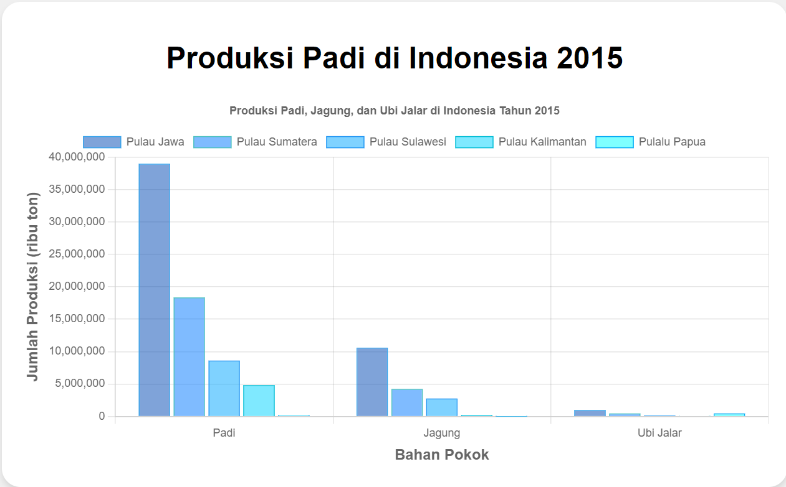
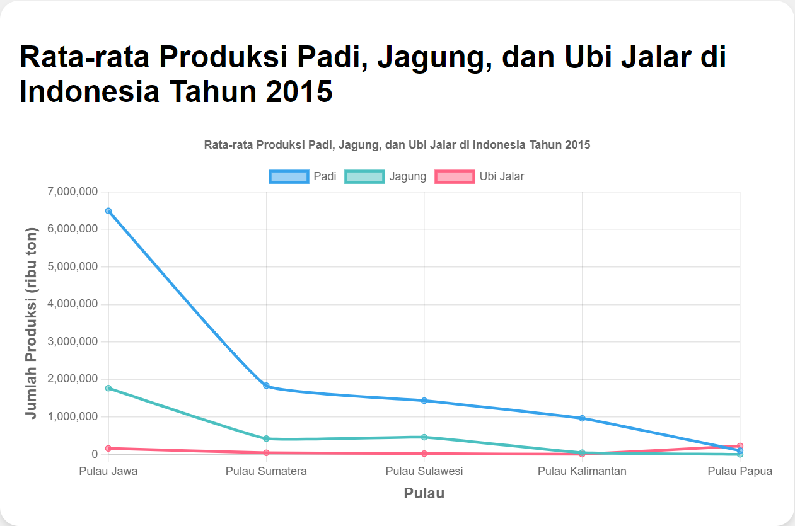
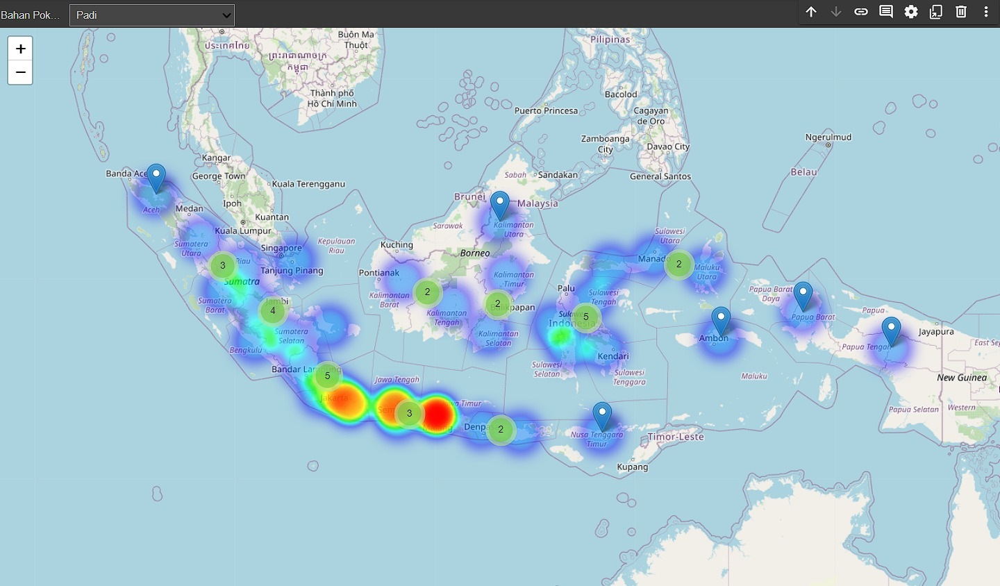
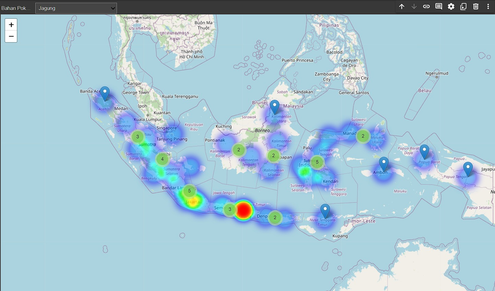
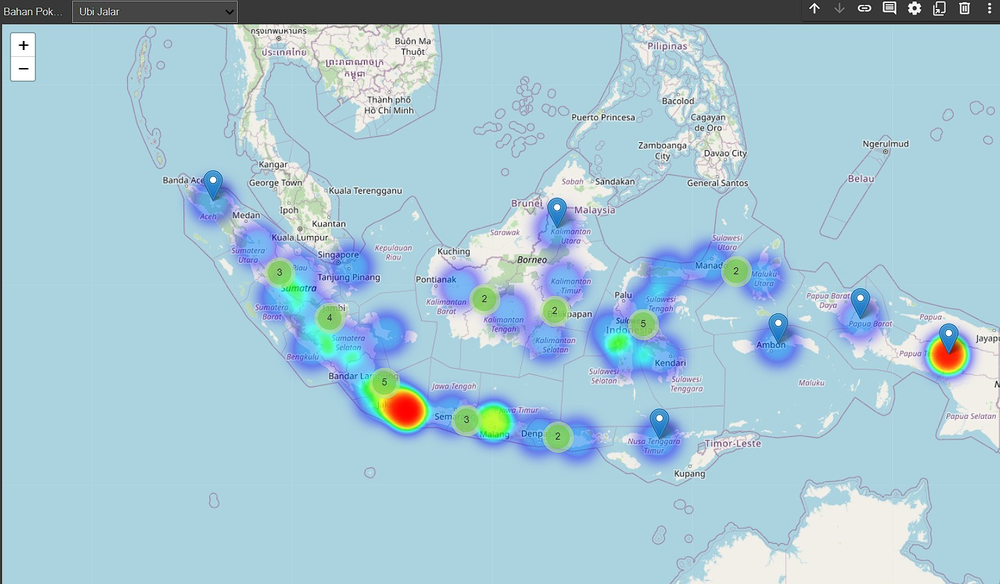

# Projek Akhir Rekayasa Perangkat Lunak P3 Kelompok 10

### Daftar Isi

- [Deskripsi](#deskripsi)
- [Dokumentasi](#dokumentasi)
- [Anggota Kelompok](#anggota-kelompok)

## Deskripsi 

Padi merupakan bahan makanan yang menghasilkan beras yang juga merupakan tanaman pokok bagi penduduk Indonesia yang di konsumsi guna mempertahankan kelangsungan hidupnya. Beras merupakan padi yang berasal dari tumbuh-tumbuhan golongan rumput-rumputan (gramineae) yang telah banyak dibudidayakan di Indonesia sejak lama. Selain itu Indonesia berada pada urutan ke tujuh Negara dengan areal jagung terluas dan urutan ke Sembilan Negara penghasil jagung terbesar di dunia. Di Indonesia jagung merupakan bahan pangan penting, sumber karbohidrat kedua setelah beras. Selain padi dan jagung ubi jalar merupakan salah satu makanan pokok bagi sekelompok penduduk Indonesia, karena itu tanaman ubi jalar ikut memegang peranan penting di dalam posisi lumbung pangan nasional. Tanaman tersebut juga memegang peranan penting dalam perekonomian nasional, terutama di kalangan masyarakat pedesaan di Indonesia.

## Dokumentasi
<table>
  <tbody>
    <tr>
      <td></td>
      <td></td>
    </tr>
    <tr>    
      <td></td>
      <td></td>
    </tr>
    <tr>
      <td></td>
    </tr>
  </tbody>
</table>

## Anggota Kelompok
| Nama                  | NIM           | Username Github                   |
| :-------------------- | :------------ | :-------------------------------- |
| Fari Hafizh Nugroho   | G6401221056   | https://github.com/      |
| Raden Fitzal B.N.W    | G6401201086   | https://github.com/Fitznug045     |
| Rio Alvein Hasana     | G6401201042   | https://github.com/alveinr1o      |

